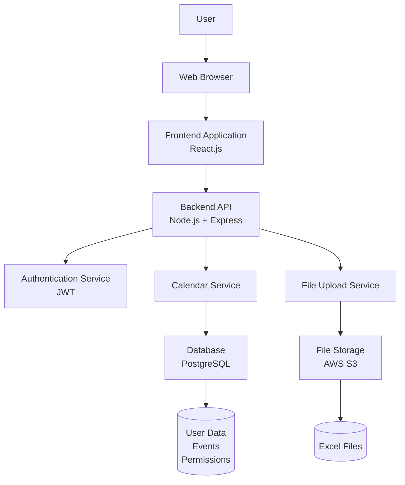

#AI-copilot-vibe-app:

#Prompt-
For the below Application specification, please create:
1. User journey
2. Technical stack
3. High level system architecture diagram

#Application specification-

Application specification:
This is an application that allows multiple users to share their personal calendars in view-only and view-and-edit modes.
To begin with each user is presented with a blank calendar for the current and next 3 calendar years.
Users can update their calendars either by interactively adding events or by submitting an excel-sheet that has events listed for specific dates.Each user can keep their calendar private or share it with other users. 
Each user can grant view or view-and-edit access to users they have shared their calendar with.
Every event shown on the calendar also show which created it. Supported event creation methods are - 1) manual entry via a user interface for start-date, (optional) end-date, event name and optional event details or 2) events entered via an excel-sheet upload with start-date, (optional) end-date, event name and optional event details.
If not end-date is provided, assume the event is a single day event on the start-date.

# 1. User Journey

The user journey outlines the key steps a user takes to interact with the calendar sharing application:

1. **Registration/Login**: New users create an account with email and password. Existing users log in to access their dashboard.

2. **Personal Calendar View**: After login, users are presented with their personal calendar showing the current year and the next 3 years. The calendar starts blank.

3. **Adding Events Manually**:
   - User selects a date on the calendar.
   - Enters event details: start date (pre-filled), optional end date, event name, and optional details.
   - Saves the event, which appears on the calendar with the user's name as creator.

4. **Uploading Events via Excel**:
   - User navigates to the upload section.
   - Selects and uploads an Excel file with columns for start-date, end-date (optional), event name, and details.
   - System processes the file, validates data, and adds events to the calendar.
   - Events are attributed to the uploading user.

5. **Sharing Calendar**:
   - User accesses sharing settings for their calendar.
   - Searches for other users by email or username.
   - Grants view-only or view-and-edit permissions to selected users.

6. **Viewing Shared Calendars**:
   - User sees a list of calendars shared with them.
   - Selects a shared calendar to view in read-only mode or edit mode based on permissions.
   - Events display the creator's name.

7. **Editing Shared Calendars** (if edit permission granted):
   - User can add, edit, or delete events on the shared calendar.
   - New events are attributed to the editing user.

8. **Managing Permissions**:
   - User can revoke access or change permissions for shared calendars at any time.

9. **Logout**: User logs out to secure their session.

# 2. Technical Stack

The proposed technical stack for building this calendar sharing application includes:

- **Frontend**:
  - React.js: For building the user interface, including calendar views and forms.
  - React Big Calendar or FullCalendar: For rendering interactive calendar components.
  - Axios: For making API calls to the backend.

- **Backend**:
  - Node.js with Express.js: For building RESTful APIs to handle user authentication, calendar operations, and file uploads.
  - JWT (JSON Web Tokens): For secure user authentication and session management.

- **Database**:
  - PostgreSQL: Relational database for storing user data, events, permissions, and calendar metadata.

- **File Handling**:
  - Multer: Middleware for handling file uploads (Excel files).
  - xlsx or exceljs: Libraries for parsing Excel files to extract event data.

- **Authentication & Security**:
  - bcrypt: For hashing passwords.
  - Helmet: For securing Express apps with various HTTP headers.

- **Deployment & Hosting**:
  - AWS (Amazon Web Services): EC2 for server hosting, S3 for file storage, RDS for database.
  - Docker: For containerizing the application for easy deployment.

- **Other Tools**:
  - Git: Version control.
  - ESLint and Prettier: Code quality and formatting.
  - Jest: For unit testing.

# 3. High Level System Architecture Diagram

